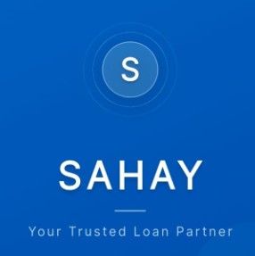

<div align="center">

# 🏦 SAHAY — Micro-Loan Platform

### *Empowering underserved communities with accessible micro-credit*

[](https://flutter.dev)
[](https://fastapi.tiangolo.com)
[](https://firebase.google.com)
[](https://python.org)
[](https://stripe.com)
[](LICENSE)

<br/>



</div>

---

**SAHAY** (meaning *"Help"* in Hindi) is a full-stack micro-lending platform designed for underserved communities in India. Users can apply for micro-loans up to ₹1,00,000, get AI-powered credit scoring, complete KYC digitally, and repay EMIs online — all from their phone.

---

## 📋 Table of Contents

- [Features](#-features)
- [Architecture](#-architecture)
- [Tech Stack](#️-tech-stack)
- [Project Structure](#-project-structure)
- [Getting Started](#-getting-started)
- [Environment Variables](#-environment-variables)
- [Firebase Setup](#-firebase-setup)
- [Running Locally](#-running-locally)
- [Building for Production](#-building-for-production)
- [User Roles](#-user-roles)
- [Loan Workflow](#-loan-workflow)
- [API Overview](#-api-overview)
- [FAQ](#-faq)
- [License](#-license)

---

## ✨ Features

### 👤 For Users (Borrowers)
| Feature | Description |
|---|---|
| 🔐 Secure Auth | Firebase email/password authentication |
| 📋 Digital KYC | Aadhaar & PAN card scanning via Tesseract OCR |
| 🤖 AI Credit Score | ML model (Random Forest) evaluates creditworthiness |
| 💰 Loan Application | Apply for ₹500–₹1,00,000 with custom duration |
| 📊 EMI Calculator | Computes monthly installments & total payable |
| 💳 Online Repayments | Stripe-powered EMI payments |
| 🔔 Notifications | Real-time Firebase push alerts for loan status |
| 📅 Repayment Schedule | Month-by-month schedule with overdue tracking |
| 📱 Cross-Platform | Android, iOS, Web, Windows, macOS, Linux |

### 🏢 For Admins
| Feature | Description |
|---|---|
| 📈 Dashboard | Overview stats: users, loans, revenue |
| 👥 User Management | View KYC status, verification details |
| 💼 Loan Pipeline | Review, approve, reject, or share with providers |
| 🏦 Provider Management | Onboard and manage lending partners |
| 📊 Analytics | Charts for loan disbursements and repayment rates |

### 🤝 For Loan Providers
| Feature | Description |
|---|---|
| 📬 Shared Applications | View borrower profiles shared by admin |
| ✅ Decision Making | Approve or reject applications with notes |
| 📂 Document Access | View uploaded KYC and supporting documents |
| 📊 Portfolio | Track loans associated with their profile |

---

## 🏗️ Architecture

```
┌─────────────────────────────────────────────────────────────┐
│                     Flutter App (Client)                      │
│          Android │ iOS │ Web │ Windows │ macOS │ Linux        │
└──────────────────────────┬──────────────────────────────────┘
                           │  HTTP/REST
                           ▼
┌─────────────────────────────────────────────────────────────┐
│                   FastAPI Backend (Python)                    │
│  /auth  /user  /admin  /provider  /payments  /documents      │
└──────┬──────────────────────────────────────────────────────┘
       │                          │
       ▼                          ▼
┌─────────────┐         ┌─────────────────────┐
│   Firebase   │         │   External Services  │
│  Firestore  │         │  Stripe  │  Gmail    │
│  Auth       │         │  Tesseract OCR       │
│  Messaging  │         │  Google Vision API   │
└─────────────┘         └─────────────────────┘
```

---

## 🛠️ Tech Stack

### Frontend
- **Flutter 3.10+** — Cross-platform UI framework
- **Provider** — State management
- **Firebase Auth + Firestore** — Auth & real-time data
- **Firebase Messaging** — Push notifications
- **flutter_stripe** — Payment UI
- **fl_chart** — Charts and analytics
- **flutter_animate** — Smooth animations
- **Google Fonts (Inter)** — Typography

### Backend
- **FastAPI** — High-performance Python REST API
- **Firebase Admin SDK** — Server-side Firestore & Auth
- **scikit-learn + joblib** — ML credit scoring model
- **Tesseract OCR / pytesseract** — KYC document extraction
- **Stripe Python SDK** — Payment intent creation
- **SMTP (Gmail)** — Email notifications
- **python-dotenv** — Secrets management

---

## 📁 Project Structure

```
sahay_loan_app/
│
├── lib/                          # Flutter source code
│   ├── main.dart                 # App entry point
│   ├── app.dart                  # Router & theme setup
│   ├── core/
│   │   ├── constants/            # API endpoints, app colours
│   │   ├── services/             # HTTP service layer
│   │   └── widgets/              # Shared widgets
│   ├── models/                   # Dart data models
│   │   ├── loan_model.dart
│   │   ├── company_model.dart
│   │   └── user_model.dart
│   ├── providers/                # Provider state classes
│   ├── screens/
│   │   ├── admin/                # Admin dashboard & screens
│   │   ├── auth/                 # Login / Register screens
│   │   ├── onboarding/           # Splash & onboarding flow
│   │   ├── provider/             # Loan provider screens
│   │   └── user/                 # Borrower screens
│   └── widgets/                  # Reusable UI components
│
├── backend/                      # FastAPI Python backend
│   ├── main.py                   # Server entry point (CORS, router)
│   ├── requirements.txt          # Python dependencies
│   ├── .env.example              # ← Copy this to .env and fill in values
│   ├── serviceAccountKey.json.example  # ← Firebase service account template
│   ├── credit_scaler.pkl         # Feature scaler for ML model
│   └── app/
│       ├── api/
│       │   └── endpoints/
│       │       ├── auth.py       # Registration, login, KYC
│       │       ├── user.py       # Loan apply, repayments, profile
│       │       ├── admin.py      # Admin loan & user management
│       │       ├── provider.py   # Provider decision endpoints
│       │       ├── payments.py   # Stripe payment intents
│       │       └── provider_documents.py
│       ├── core/
│       │   └── config.py         # Settings loaded from .env
│       ├── models/               # Pydantic request/response models
│       ├── services/             # Firebase, email, ML, OCR logic
│       └── utils/                # Helper utilities
│
├── android/                      # Android platform files
│   └── app/
│       └── google-services.json.example  # ← Firebase config template
├── ios/                          # iOS platform files
├── assets/
│   ├── images/                   # App images & banners
│   └── icons/                    # SVG icons
├── pubspec.yaml                  # Flutter dependencies
├── analysis_options.yaml         # Dart lint rules
├── NGROK_SETUP.md                # Guide for ngrok tunnelling
├── SETUP.md                      # Detailed local setup guide
└── install_tesseract.ps1         # Windows Tesseract installer script
```

---

## 🚀 Getting Started

### Prerequisites

| Tool | Version | Notes |
|---|---|---|
| Flutter SDK | ≥ 3.10.0 | [Install Flutter](https://docs.flutter.dev/get-started/install) |
| Dart SDK | ≥ 3.0.0 | Bundled with Flutter |
| Python | ≥ 3.9 | [python.org](https://python.org) |
| Tesseract OCR | Latest | Required for KYC scanning |
| Firebase CLI | Latest | `npm install -g firebase-tools` |
| Git | Latest | [git-scm.com](https://git-scm.com) |

---

## ⚙️ Environment Variables

### Backend (`backend/.env`)

Copy the example file and fill in your values:

```bash
cp backend/.env.example backend/.env
```

```env
# ── Firebase ────────────────────────────────────────────────
FIREBASE_WEB_API_KEY=your_firebase_web_api_key


# ── Gmail SMTP (for email notifications) ────────────────────
# Generate an App Password at: https://myaccount.google.com → Security → App Passwords
GMAIL_SENDER_EMAIL=your_email@gmail.com
GMAIL_APP_PASSWORD=your_16_digit_app_password_no_spaces

# ── Business Logic ───────────────────────────────────────────
MAX_LOAN_AMOUNT=100000

# ── Stripe (Test Mode) ───────────────────────────────────────
STRIPE_SECRET_KEY=sk_test_your_stripe_secret_key
STRIPE_PUBLISHABLE_KEY=pk_test_your_stripe_publishable_key
```

> ⚠️ **Never commit `.env` or `serviceAccountKey.json` to version control.**

### Firebase Service Account (`backend/serviceAccountKey.json`)

```bash
cp backend/serviceAccountKey.json.example backend/serviceAccountKey.json
# Then populate it with your real Firebase service account credentials
```

Download your real key from:  
**Firebase Console → Project Settings → Service Accounts → Generate new private key**

---

## 🔥 Firebase Setup

1. Go to [console.firebase.google.com](https://console.firebase.google.com) and create a new project.

2. **Authentication** → Enable *Email/Password* sign-in.

3. **Firestore Database** → Create in production or test mode.

4. **Cloud Messaging** → Enable for push notifications.

5. **Android App**:
   - Register your Android app (package: `com.example.sahay_loan_app`)
   - Download `google-services.json` → place in `android/app/`

6. **iOS App** (optional):
   - Register iOS app → download `GoogleService-Info.plist` → place in `ios/Runner/`

7. **Backend**:
   - Go to *Project Settings → Service Accounts*
   - Click **Generate new private key** → save as `backend/serviceAccountKey.json`

---

## 🖥️ Running Locally

### 1. Clone the Repository

```bash
git clone https://github.com/Shravan157/Sahay-Loan.git
cd Sahay-Loan
```

### 2. Install Tesseract OCR

**Windows** (run as Administrator):
```powershell
.\install_tesseract.ps1
# Or manually download from: https://github.com/UB-Mannheim/tesseract/wiki
```

**macOS**:
```bash
brew install tesseract
```

**Ubuntu/Debian**:
```bash
sudo apt-get install tesseract-ocr
```

### 3. Setup & Run the Backend

```bash
cd backend

# Create and activate virtual environment
python -m venv venv
venv\Scripts\activate          # Windows
# source venv/bin/activate     # macOS / Linux

# Install dependencies
pip install -r requirements.txt

# Copy and fill in environment variables
cp .env.example .env
cp serviceAccountKey.json.example serviceAccountKey.json
# ← Edit .env and serviceAccountKey.json with your real values

# Train / obtain the ML model
# Place credit_model.pkl in backend/ (see ML Model section below)

# Start the server
python main.py
# Server runs at http://localhost:8000
# API docs at http://localhost:8000/docs
```

### 4. Setup & Run the Flutter App

```bash
# In a new terminal, from the project root
flutter pub get

# For web (Chrome) — connects to localhost:8000 automatically
flutter run -d chrome

# For Android device/emulator
flutter run -d <device_id>

# For Windows desktop
flutter run -d windows
```

### 5. Running on a Physical Mobile Device

1. Your phone and PC must be on the **same Wi-Fi network**.
2. Find your PC's local IP:  
   - Windows: `ipconfig` → look for IPv4 Address
   - macOS/Linux: `ifconfig`
3. Update the IP in `lib/core/constants/api_endpoints.dart`:
   ```dart
   return 'http://192.168.X.X:8000'; // replace with your actual IP
   ```
4. Run `flutter run -d <device_id>`.

### 6. Using ngrok for Remote / USB Debugging

See [`NGROK_SETUP.md`](NGROK_SETUP.md) for the full guide.

```powershell
# Terminal 1 — start backend
cd backend && python main.py

# Terminal 2 — expose backend via ngrok
ngrok http 8000

# Copy the ngrok HTTPS URL and update api_endpoints.dart
```

---

## 🤖 ML Credit Scoring Model

The backend uses a trained **Random Forest** binary classifier to assess loan eligibility.

| File | Description |
|---|---|
| `backend/credit_model.pkl` | Trained model (**not committed** — too large) |
| `backend/credit_scaler.pkl` | Feature scaler (committed) |

**To obtain the model:**

The model file is excluded from Git due to its size (~88 MB). Options:
- **Train your own**: Retrain with the scikit-learn pipeline in `backend/app/services/` using credit risk data.
- **Download**: Contact the project maintainer for the pre-trained model file.
- **Git LFS**: If you fork this repo, you can add `credit_model.pkl` to Git LFS.

---

## 📦 Building for Production

```bash
# Android APK
flutter build apk --release
# Output: build/app/outputs/flutter-apk/app-release.apk

# Android App Bundle (Play Store)
flutter build appbundle --release

# iOS (requires macOS + Xcode)
flutter build ios --release

# Web
flutter build web --release

# Windows
flutter build windows --release
```

---

## 👤 User Roles

| Role | Access Level | Description |
|---|---|---|
| **User** | Borrower | Apply for loans, pay EMIs, view schedule |
| **Admin** | Full | Manage users, loans, providers; view analytics |
| **Loan Provider** | Limited | View shared applications, approve/reject |

Role is stored in Firestore under the `users` collection as a `role` field (`user` / `admin` / `provider`).

---

## 🔄 Loan Workflow

```
User Applies
     │
     ▼
[pending] ──── Admin Reviews ────► [under_review]
                                        │
                          ┌─────────────┴───────────────┐
                          ▼                             ▼
                  [Admin Approves]            [Shared with Provider]
                  [approved]                  [shared_with_provider]
                          │                             │
                          │                   Provider Approves/Rejects
                          │                             │
                          ▼                             ▼
                   [disbursed]               [provider_approved] / [provider_rejected]
                          │
                   User Pays EMIs
                          │
                          ▼
                    [completed]
```

---

## 🔌 API Overview

The backend runs at `http://localhost:8000`. Interactive API docs available at `/docs`.

| Method | Endpoint | Description |
|---|---|---|
| `POST` | `/auth/register` | Register a new user |
| `POST` | `/auth/login` | Login and get token |
| `POST` | `/auth/kyc/upload` | Upload KYC documents (OCR) |
| `GET` | `/user/loans` | Get user's loans |
| `POST` | `/user/loans/apply` | Apply for a loan |
| `GET` | `/user/repayments/{loan_id}` | Get repayment schedule |
| `POST` | `/payments/create-intent` | Create Stripe payment intent |
| `POST` | `/payments/confirm` | Confirm EMI payment |
| `GET` | `/admin/loans` | Get all loans (Admin) |
| `POST` | `/admin/loans/{id}/approve` | Approve a loan (Admin) |
| `POST` | `/admin/loans/{id}/share` | Share with provider (Admin) |
| `GET` | `/provider/loans` | Get shared loans (Provider) |
| `POST` | `/provider/loans/{id}/decide` | Approve/reject (Provider) |

---

## ❓ FAQ

**Q: The app says "Connection refused" on my phone.**  
A: Make sure the backend is running, and both devices are on the same Wi-Fi. Update the IP in `api_endpoints.dart`.

**Q: OCR isn't working.**  
A: Ensure Tesseract is installed and its path is added to your system `PATH`. Run `tesseract --version` to verify.

**Q: Stripe payment fails in test mode.**  
A: Use Stripe test card `4242 4242 4242 4242` with any future expiry and any CVC.

**Q: Where is `credit_model.pkl`?**  
A: It's not committed due to its large size (~88 MB). Train it locally or contact the maintainer.

---

## 🤝 Contributing

1. Fork the repository
2. Create a feature branch: `git checkout -b feature/your-feature`
3. Commit with a clear message: `git commit -m "feat: add your feature"`
4. Push to the branch: `git push origin feature/your-feature`
5. Open a Pull Request

---

## 📝 License

This project is licensed under the **MIT License** — see the [LICENSE](LICENSE) file for details.

---

<div align="center">

Made with ❤️ by **Shravan**

</div>
